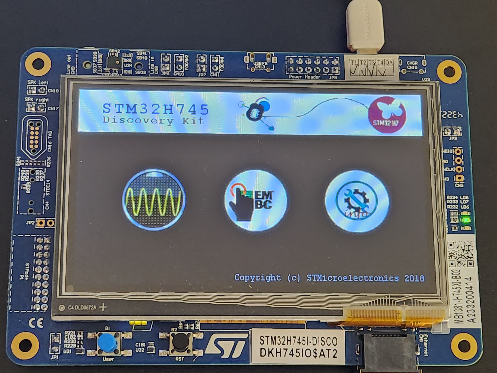

# CAN FD Classic Networking Prototype

## Overview
This is a basic prototype for CAN FD (Controller Area Network Flexible Data-rate) classic networking, demonstrating fundamental message handling over CAN FD networks on STM32H745 MCUs.

## Hardware
STM32H745I Discovery Kit

## Setup and Usage
1. Clone the repository: `git clone https://github.com/SystemsCyber/DELVEC/tree/dev/prototype/FDCAN_Classic_Frame_Networking`
2. Open the project in STM32CubeIDE and build it.
3. Flash the program to the STM32 microcontroller with CAN FD hardware support.
4. The prototype is set up for basic message sending and receiving over a CAN FD network.

